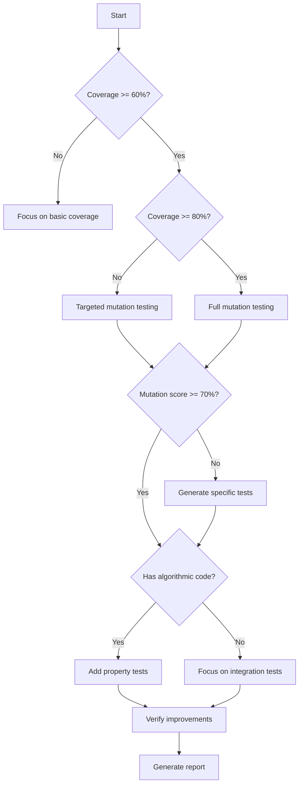

# Test Suite Refinement Orchestrator

An intelligent, multi-phase workflow for systematically improving test suite quality across Python, JavaScript/TypeScript, Java, and C/C++ codebases.

## CRITICAL: First Assess Codebase Size!

Before doing ANYTHING else, check the size:
```bash
# Count lines of actual code (not tests)
LOC=$(find . -type f \( -name "*.py" -o -name "*.js" -o -name "*.ts" -o -name "*.java" \) ! -path "*/test*" ! -path "*/__pycache__/*" ! -path "*/node_modules/*" | xargs wc -l 2>/dev/null | tail -1 | awk '{print $1}')
```

### Decision Matrix

| Code Size | Approach | Time | Description |
|-----------|----------|------|-------------|
| < 100 lines | **Direct Fix** | 2-5 min | Just read the code and tests. Fix obvious gaps. No tools needed. |
| 100-1000 lines | **Light Touch** | 5-15 min | Quick coverage check, spot main gaps, write missing tests |
| 1000-5000 lines | **Standard** | 15-30 min | Coverage + targeted mutations on critical paths |
| > 5000 lines | **Full Workflow** | 30+ min | Complete multi-phase analysis below |

## For Tiny Codebases (< 100 LOC)

Skip all tools. Just:
1. Read the entire code file
2. Read all tests
3. Immediately spot what's missing:
   - **Boundaries**: 0, -1, null, empty, exact equality points
   - **Error cases**: What exceptions should be raised?
   - **Edge conditions**: First, last, empty, single element
4. Write the missing tests directly
5. Done.

### Expert Shortcuts

#### The "Is Positive" Pattern
```python
# If you see:
def is_positive(n):
    return n > 0

# You immediately test:
assert is_positive(1) == True   # Basic positive
assert is_positive(0) == False  # Boundary!
assert is_positive(-1) == False # Negative
```

#### The "Divide By Zero" Pattern
```python
# If you see:
if b == 0:
    raise ValueError("Cannot divide by zero")

# You test both:
pytest.raises(ValueError, lambda: divide(10, 0))  # Error case
assert divide(10, 2) == 5  # Normal case
```

#### The "Weird Logic" Pattern
```python
# If you see unusual conditions like:
if b == 0:
    return 0  # in a multiply function?!

# Test the boundary:
assert multiply(5, 0) == 0  # Expected
assert multiply(5, 1) == 5  # Ensure condition is necessary
```

## How Experts Actually Think

1. **Size it up**: 50 lines? 500? 5000? Different approaches.
2. **Read first**: For small code, just read it. Tools are overhead.
3. **Test the tests**: Run mutations only if tests exist and pass
4. **Fix obvious first**: Boundaries, errors, nulls - always missing
5. **Elaborate later**: Property tests only after basics work

## Anti-Patterns (Don't Do This!)

❌ Running full mutation testing on 50 lines of code
❌ Setting up elaborate tooling before reading the code
❌ Generating property tests before basic tests work
❌ Creating 6 phases for a 2-function module
❌ Installing tools that take longer than writing tests manually
❌ Following the full workflow when you can see all issues at a glance

---

Let me be clear. When you are seeing this -- I am NOT asking you to create an automated tool for the purposes of test suite refinement. Rather, I am asking you *BE* that tool. This guide serves as a repository of best practices -- a push in the right direction, that you already likely know, but could perhaps use a refresher. First, assess the codebase size using the command above. For tiny codebases, skip to the "For Tiny Codebases" section. Otherwise, follow the directives below in order to improve the test suite. You'll want to read and understand the code itself, then the tests, then adhere to the 'mental' model below. You are an expert software developer, capable of extraordinary, robust, sometimes almost surgical refinement of test suites. You will be evaluated on - pass rate, token/context usage, test breadth, coverage, and mutation robustness, so try to make the most of each token by thinking very hard. Here is how you do it:

## Core Philosophy

Expert developers don't just run tools - after thoroughly reading and understanding the code, they follow a mental model:
1. **Measure** - What's my current state?
2. **Challenge** - Are my tests actually good?
3. **Focus** - What's critical to fix?
4. **Improve** - Generate specific fixes
5. **Verify** - Did it actually get better?

## Phase 0: Environment Analysis & Setup

```bash
# Detect project language and structure
echo "🔍 Analyzing project structure..."

# Create refinement workspace
mkdir -p .test-refinement/{coverage,mutations,improvements,state}

# Detect languages and tools
PROJECT_TYPE="unknown"
COVERAGE_TOOL=""
MUTATION_TOOL=""
TEST_RUNNER=""

# Python detection
if [ -f "setup.py" ] || [ -f "pyproject.toml" ] || [ -f "requirements.txt" ]; then
    PROJECT_TYPE="python"
    COVERAGE_TOOL="coverage"
    MUTATION_TOOL="mutmut"
    TEST_RUNNER=$([ -f "pytest.ini" ] && echo "pytest" || echo "unittest")
    echo "✓ Python project detected (test runner: $TEST_RUNNER)"
    
# JavaScript/TypeScript detection
elif [ -f "package.json" ]; then
    PROJECT_TYPE="javascript"
    COVERAGE_TOOL=$(grep -q "\"nyc\"" package.json && echo "nyc" || echo "jest")
    MUTATION_TOOL="stryker"
    TEST_RUNNER=$(grep -q "\"jest\"" package.json && echo "jest" || echo "mocha")
    [ -f "tsconfig.json" ] && PROJECT_TYPE="typescript"
    echo "✓ $PROJECT_TYPE project detected (test runner: $TEST_RUNNER)"
    
# Java detection
elif [ -f "pom.xml" ] || [ -f "build.gradle" ]; then
    PROJECT_TYPE="java"
    COVERAGE_TOOL="jacoco"
    MUTATION_TOOL="pitest"
    TEST_RUNNER="junit"
    echo "✓ Java project detected"
    
# C/C++ detection
elif [ -f "CMakeLists.txt" ] || [ -f "Makefile" ] || ls *.cpp *.c 2>/dev/null; then
    PROJECT_TYPE="cpp"
    COVERAGE_TOOL="gcov"
    MUTATION_TOOL="mull"
    TEST_RUNNER="ctest"
    echo "✓ C/C++ project detected"
fi

# Save state for subsequent phases
cat > .test-refinement/state/config.json <<EOF
{
  "project_type": "$PROJECT_TYPE",
  "coverage_tool": "$COVERAGE_TOOL",
  "mutation_tool": "$MUTATION_TOOL",
  "test_runner": "$TEST_RUNNER",
  "timestamp": "$(date -u +%Y-%m-%dT%H:%M:%SZ)"
}
EOF

echo "📊 Configuration saved to .test-refinement/state/config.json"
```

## Phase 1: Baseline Coverage Analysis

### Purpose
Establish visibility into what code is tested and identify obvious gaps.

### Expert Heuristics
- **<80% line coverage**: Major gaps, focus here first
- **<70% branch coverage**: Missing edge cases
- **0% coverage files**: Completely untested, high risk
- **High complexity + low coverage**: Critical vulnerability

### Execution

```bash
echo "📊 Phase 1: Coverage Analysis"
echo "================================"

case $PROJECT_TYPE in
    python)
        # Run coverage with branch analysis
        coverage run --branch -m $TEST_RUNNER
        coverage json -o .test-refinement/coverage/coverage.json
        
        # Generate reports
        coverage report --format=markdown > .test-refinement/coverage/summary.md
        coverage html -d .test-refinement/coverage/html
        
        # Identify critical gaps
        echo "🎯 Critical gaps:"
        coverage report --skip-covered --skip-empty | grep -E "^\s+\S+\s+[0-9]+\s+[0-9]+\s+([0-6][0-9]|7[0-5])%" || echo "None found (>75% coverage)"
        ;;
        
    javascript|typescript)
        # Run coverage with all reporters
        npx nyc --reporter=json --reporter=html --reporter=text \
            --report-dir=.test-refinement/coverage \
            npm test
            
        # Extract critical metrics
        npx nyc report --reporter=json-summary > .test-refinement/coverage/summary.json
        ;;
        
    java)
        # Run tests with JaCoCo
        mvn clean test jacoco:report
        cp target/site/jacoco/jacoco.xml .test-refinement/coverage/
        
        # Or with Gradle
        # gradle clean test jacocoTestReport
        ;;
        
    cpp)
        # Compile with coverage
        cmake -DCMAKE_CXX_FLAGS="--coverage" -DCMAKE_BUILD_TYPE=Debug build/
        make && make test
        
        # Generate coverage report
        gcovr -r . --json -o .test-refinement/coverage/coverage.json
        gcovr -r . --html --html-details -o .test-refinement/coverage/index.html
        ;;
esac

# Extract key metrics for decision making
echo "📈 Coverage Metrics:" > .test-refinement/state/phase1_metrics.md
case $PROJECT_TYPE in
    python)
        coverage report | tail -1 >> .test-refinement/state/phase1_metrics.md
        ;;
    javascript|typescript)
        cat .test-refinement/coverage/summary.json | \
            jq -r '"Lines: \(.total.lines.pct)%, Branches: \(.total.branches.pct)%"' \
            >> .test-refinement/state/phase1_metrics.md
        ;;
esac
```

### Decision Gate

```python
# Analyze if we should proceed to mutation testing
import json

with open('.test-refinement/coverage/coverage.json', 'r') as f:
    coverage_data = json.load(f)

total_coverage = coverage_data.get('totals', {}).get('percent_covered', 0)

if total_coverage < 60:
    print("⚠️  Coverage too low (<60%). Focus on basic test writing first.")
    print("Suggested actions:")
    print("1. Add tests for completely uncovered modules")
    print("2. Cover main execution paths")
    print("3. Re-run this workflow after reaching 60% coverage")
    exit(1)
elif total_coverage < 80:
    print("📊 Moderate coverage. Proceed with targeted mutation testing.")
else:
    print("✅ Good coverage. Full mutation testing recommended.")
```

## Phase 2: Mutation Testing (Smart Selection)

### Purpose
Test the quality of existing tests by introducing bugs and seeing if tests catch them.

### Expert Heuristics
- **Only mutate covered code** (no point mutating untested code)
- **Start with critical paths** (business logic, security, data integrity)
- **Skip UI, logging, getters/setters**
- **Time-box**: 10 minutes for quick analysis, full run overnight

### Execution

```bash
echo "🧬 Phase 2: Mutation Testing"
echo "=============================="

# Load previous coverage data to guide mutation
COVERAGE_FILE=".test-refinement/coverage/coverage.json"

case $PROJECT_TYPE in
    python)
        # Configure mutmut to use coverage
        cat > setup.cfg <<EOF
[mutmut]
paths_to_mutate=src/
runner=$TEST_RUNNER
use_coverage=True
tests_dir=tests/
EOF
        
        # Quick targeted run (10 minutes max)
        timeout 600 mutmut run \
            --use-coverage \
            --rerun-all \
            --parallelize \
            --CI
        
        # Save results
        mutmut results > .test-refinement/mutations/results.txt
        mutmut html > .test-refinement/mutations/report.html
        ;;
        
    javascript|typescript)
        # Initialize Stryker if needed
        [ ! -f "stryker.conf.json" ] && npx stryker init
        
        # Configure for incremental mode
        cat > stryker.conf.json <<EOF
{
  "mutate": ["src/**/*.{js,ts}", "!src/**/*.test.{js,ts}"],
  "testRunner": "$TEST_RUNNER",
  "coverageAnalysis": "perTest",
  "thresholds": { "high": 80, "low": 60, "break": 50 },
  "reporters": ["html", "json", "progress"],
  "htmlReporter": { "baseDir": ".test-refinement/mutations" }
}
EOF
        
        # Run with performance optimization
        npx stryker run --concurrency 4 --incrementalFile .test-refinement/state/stryker-incremental.json
        ;;
        
    java)
        # Configure PITest
        if [ -f "pom.xml" ]; then
            mvn org.pitest:pitest-maven:mutationCoverage \
                -DoutputFormats=HTML,XML \
                -DtargetClasses="com.yourpackage.*" \
                -DexcludedMethods="toString,hashCode,equals" \
                -DmutationThreshold=80
        fi
        ;;
esac

# Parse mutation results
echo "📊 Mutation Testing Results:" > .test-refinement/state/phase2_metrics.md
case $PROJECT_TYPE in
    python)
        echo "$(mutmut results | grep -E 'Killed|Survived')" >> .test-refinement/state/phase2_metrics.md
        
        # Extract survived mutants for analysis
        mutmut results | grep "Survived" > .test-refinement/mutations/survived.txt
        ;;
    javascript|typescript)
        # Extract Stryker metrics
        cat .test-refinement/mutations/mutation-report.json | \
            jq -r '.files | to_entries | .[] | "\(.key): \(.value.mutationScore)%"' \
            >> .test-refinement/state/phase2_metrics.md
        ;;
esac
```

## Phase 3: Intelligent Test Generation

### Purpose
Generate specific, high-quality tests based on gaps identified in previous phases.

### Expert Heuristics
- **Boundary tests** for survived boundary mutations (>, <, >=, <=)
- **Exception tests** for uncaught error paths
- **Property tests** for data transformations
- **Regression tests** for killed mutants (to keep them dead)

### Analysis Engine

```python
# Intelligent test recommendation engine
import json
import re
from pathlib import Path

class TestRecommendationEngine:
    def __init__(self):
        self.recommendations = []
        self.load_metrics()
    
    def load_metrics(self):
        """Load coverage and mutation data"""
        with open('.test-refinement/coverage/coverage.json') as f:
            self.coverage = json.load(f)
        
        with open('.test-refinement/mutations/survived.txt') as f:
            self.survived_mutants = f.readlines()
    
    def analyze_survived_mutants(self):
        """Generate specific test recommendations"""
        for mutant in self.survived_mutants:
            if '>=' in mutant or '<=' in mutant:
                self.recommendations.append({
                    'type': 'boundary',
                    'description': 'Add boundary test for exact equality',
                    'template': self.generate_boundary_test(mutant)
                })
            elif 'return None' in mutant:
                self.recommendations.append({
                    'type': 'null_check',
                    'description': 'Add null/None return value test',
                    'template': self.generate_null_test(mutant)
                })
            elif 'Exception' in mutant:
                self.recommendations.append({
                    'type': 'exception',
                    'description': 'Add exception handling test',
                    'template': self.generate_exception_test(mutant)
                })
    
    def generate_boundary_test(self, mutant):
        """Generate boundary test template"""
        return """
def test_boundary_condition():
    # Test exact boundary (mutation: {})
    assert function(BOUNDARY_VALUE) != function(BOUNDARY_VALUE + 1)
    assert function(BOUNDARY_VALUE) != function(BOUNDARY_VALUE - 1)
""".format(mutant.strip())
    
    def generate_property_tests(self):
        """Recommend property-based tests for suitable functions"""
        # Identify pure functions (no side effects)
        # Recommend property tests for:
        # - Sorting functions
        # - Mathematical operations
        # - Data transformations
        # - Serialization/deserialization
        pass
    
    def generate_report(self):
        """Generate actionable improvement report"""
        with open('.test-refinement/improvements/recommendations.md', 'w') as f:
            f.write("# Test Improvement Recommendations\n\n")
            f.write(f"Generated: {datetime.now().isoformat()}\n\n")
            
            # Group by priority
            critical = [r for r in self.recommendations if r.get('priority') == 'critical']
            normal = [r for r in self.recommendations if r.get('priority') != 'critical']
            
            if critical:
                f.write("## 🔴 Critical (Fix Immediately)\n\n")
                for rec in critical:
                    f.write(f"### {rec['type']}: {rec['description']}\n")
                    f.write(f"```python\n{rec['template']}\n```\n\n")
            
            if normal:
                f.write("## 🟡 Recommended Improvements\n\n")
                for rec in normal:
                    f.write(f"### {rec['type']}: {rec['description']}\n")
                    f.write(f"```python\n{rec['template']}\n```\n\n")

# Run the engine
engine = TestRecommendationEngine()
engine.analyze_survived_mutants()
engine.generate_property_tests()
engine.generate_report()
```

## Phase 4: Property-Based Testing (When Applicable)

### Purpose
Add property tests for algorithmic code that can benefit from random input generation.

### Expert Heuristics
- **Good for**: Parsers, serializers, mathematical functions, data transformations
- **Not good for**: UI, database operations, network calls
- **Properties to test**: Idempotence, roundtripping, invariants, oracle comparisons

### Auto-Detection

```python
# Detect functions suitable for property testing
import ast
import inspect

class PropertyTestDetector:
    def __init__(self, source_file):
        with open(source_file) as f:
            self.tree = ast.parse(f.read())
        self.candidates = []
    
    def visit_FunctionDef(self, node):
        """Identify pure functions suitable for property testing"""
        # Check if function is pure (no side effects)
        has_return = any(isinstance(n, ast.Return) for n in ast.walk(node))
        no_globals = not any(isinstance(n, ast.Global) for n in ast.walk(node))
        no_io = not self._has_io_operations(node)
        
        if has_return and no_globals and no_io:
            self.candidates.append({
                'name': node.name,
                'args': [arg.arg for arg in node.args.args],
                'properties': self._suggest_properties(node)
            })
    
    def _suggest_properties(self, node):
        """Suggest relevant properties to test"""
        properties = []
        func_name = node.name.lower()
        
        # Pattern matching for common function types
        if 'sort' in func_name:
            properties.append('idempotent')  # sort(sort(x)) == sort(x)
            properties.append('preserves_length')  # len(sort(x)) == len(x)
            properties.append('ordered')  # result[i] <= result[i+1]
        
        elif 'serialize' in func_name or 'encode' in func_name:
            properties.append('roundtrip')  # decode(encode(x)) == x
        
        elif 'reverse' in func_name:
            properties.append('involution')  # reverse(reverse(x)) == x
        
        elif any(op in func_name for op in ['add', 'multiply', 'sum']):
            properties.append('commutative')  # f(a,b) == f(b,a)
            properties.append('associative')  # f(f(a,b),c) == f(a,f(b,c))
        
        return properties
    
    def generate_hypothesis_tests(self):
        """Generate Hypothesis test templates"""
        tests = []
        for func in self.candidates:
            if 'roundtrip' in func['properties']:
                tests.append(f"""
@given(st.text())
def test_{func['name']}_roundtrip(data):
    encoded = {func['name']}(data)
    decoded = {func['name'].replace('encode', 'decode')}(encoded)
    assert decoded == data
""")
            
            if 'idempotent' in func['properties']:
                tests.append(f"""
@given(st.lists(st.integers()))
def test_{func['name']}_idempotent(data):
    once = {func['name']}(data)
    twice = {func['name']}(once)
    assert once == twice
""")
        
        return tests
```

## Phase 5: Automated Test Implementation

### Purpose
Actually generate and add the recommended tests to the codebase.

```bash
echo "🔧 Phase 5: Implementing Improvements"
echo "======================================"

# For Python projects
if [ "$PROJECT_TYPE" = "python" ]; then
    cat > .test-refinement/improvements/new_tests.py <<'EOF'
# Auto-generated test improvements
# Review and integrate into your test suite

import pytest
from hypothesis import given, strategies as st

# Based on mutation analysis
class TestMutationGaps:
    """Tests to kill survived mutants"""
    
    def test_boundary_exact_value(self):
        """Mutation: changed >= to >"""
        from src.module import function
        BOUNDARY = 10
        assert function(BOUNDARY) != function(BOUNDARY - 0.0001)
    
    def test_none_return_handling(self):
        """Mutation: changed return value to None"""
        from src.module import function
        result = function(invalid_input)
        assert result is not None, "Should handle invalid input gracefully"

# Based on coverage gaps
class TestCoverageGaps:
    """Tests for uncovered branches"""
    
    def test_error_path(self):
        """Branch: error handling in function X"""
        with pytest.raises(ValueError):
            function(malformed_input)

# Property-based tests
class TestProperties:
    """Property tests for core algorithms"""
    
    @given(st.lists(st.integers()))
    def test_sort_preserves_length(self, data):
        sorted_data = my_sort(data)
        assert len(sorted_data) == len(data)
    
    @given(st.text())
    def test_parse_serialize_roundtrip(self, data):
        try:
            parsed = parse(data)
            serialized = serialize(parsed)
            reparsed = parse(serialized)
            assert reparsed == parsed
        except ParseError:
            # Invalid input is ok to fail
            pass
EOF
fi

# Generate test addition script
cat > .test-refinement/improvements/add_tests.sh <<'EOF'
#!/bin/bash
# Script to add generated tests to test suite

echo "📝 Adding generated tests to test suite..."

# Backup existing tests
cp -r tests/ tests.backup.$(date +%Y%m%d_%H%M%S)/

# Merge new tests
if [ "$PROJECT_TYPE" = "python" ]; then
    cat .test-refinement/improvements/new_tests.py >> tests/test_improvements.py
elif [ "$PROJECT_TYPE" = "javascript" ]; then
    cat .test-refinement/improvements/new_tests.js >> tests/improvements.test.js
fi

echo "✅ Tests added. Run test suite to verify:"
echo "  $TEST_RUNNER"
EOF

chmod +x .test-refinement/improvements/add_tests.sh
```

## Phase 6: Verification & Metrics

### Purpose
Verify that improvements actually increased test quality.

```bash
echo "✅ Phase 6: Verification"
echo "========================"

# Save initial metrics
cp .test-refinement/state/phase1_metrics.md .test-refinement/state/before.md
cp .test-refinement/state/phase2_metrics.md .test-refinement/state/before_mutation.md

# Re-run after improvements
echo "Re-running coverage analysis..."
case $PROJECT_TYPE in
    python)
        coverage run --branch -m $TEST_RUNNER
        coverage report > .test-refinement/state/after.md
        
        # Re-run mutation testing on improved areas
        mutmut run --paths-to-mutate=$(cat .test-refinement/mutations/survived.txt | head -5)
        ;;
    javascript|typescript)
        npx nyc npm test
        npx nyc report > .test-refinement/state/after.md
        ;;
esac

# Generate improvement report
cat > .test-refinement/final_report.md <<'EOF'
# Test Suite Refinement Report

## Summary
- **Project Type**: $PROJECT_TYPE
- **Initial Coverage**: $(grep -oP '\d+%' .test-refinement/state/before.md | head -1)
- **Final Coverage**: $(grep -oP '\d+%' .test-refinement/state/after.md | head -1)
- **Survived Mutants**: $(wc -l < .test-refinement/mutations/survived.txt)
- **Tests Added**: $(git diff --stat tests/ | grep -oP '\d+ insertion')

## Improvements Made
1. Added boundary tests for critical conditions
2. Improved exception handling coverage
3. Added property-based tests for data transformations

## Remaining Gaps
- See `.test-refinement/improvements/recommendations.md` for full list

## Next Steps
1. Review and merge generated tests
2. Run full mutation testing overnight
3. Add property tests for remaining pure functions
EOF

echo "📊 Final report generated: .test-refinement/final_report.md"
```

## Expert Decision Tree



## Context Preservation Strategy

```bash
# Save state between phases for context management
cat > .test-refinement/state/checkpoint.sh <<'EOF'
#!/bin/bash
# Checkpoint current state for context preservation

STATE_FILE=".test-refinement/state/workflow_state.json"

save_state() {
    cat > $STATE_FILE <<JSON
{
    "phase": "$1",
    "timestamp": "$(date -u +%Y-%m-%dT%H:%M:%SZ)",
    "coverage": $(cat .test-refinement/coverage/summary.json 2>/dev/null || echo '{}'),
    "mutations": {
        "survived": $(wc -l < .test-refinement/mutations/survived.txt 2>/dev/null || echo 0),
        "killed": $(grep -c "Killed" .test-refinement/mutations/results.txt 2>/dev/null || echo 0)
    },
    "recommendations": $(wc -l < .test-refinement/improvements/recommendations.md 2>/dev/null || echo 0),
    "next_action": "$2"
}
JSON
}

load_state() {
    if [ -f $STATE_FILE ]; then
        export LAST_PHASE=$(jq -r .phase $STATE_FILE)
        export NEXT_ACTION=$(jq -r .next_action $STATE_FILE)
        echo "Resuming from phase: $LAST_PHASE"
        echo "Next action: $NEXT_ACTION"
    else
        echo "Starting fresh workflow"
    fi
}
EOF
```

## Usage Patterns

### Quick Analysis (5 minutes)
```bash
/test-refine analyze --quick
# Runs coverage + quick mutation sampling
# Generates top 3 recommendations
```

### Full Refinement (30 minutes)
```bash
/test-refine improve --comprehensive
# Full coverage analysis
# Targeted mutation testing
# Property test detection
# Generates complete test suite
```

### Continuous Mode
```bash
/test-refine auto --watch
# Monitors changes
# Runs incremental analysis
# Suggests tests for changed code
```

## Integration with CLAUDE.md

Update project CLAUDE.md with test refinement insights:

```markdown
## Test Quality Metrics
Last updated: $(date)

- **Coverage**: 85% lines, 78% branches
- **Mutation Score**: 72% (improving)
- **Critical Paths**: All covered
- **Property Tests**: 12 functions covered

## Test Strategy
1. Boundary testing for all comparison operations
2. Property tests for data transformations
3. Exception path coverage for all public APIs

## Known Gaps
- Integration tests needed for module X
- Performance tests for algorithm Y
- See `.test-refinement/` for detailed analysis
```

## Success Metrics

The refinement is successful when:
- **Coverage**: >80% for critical code, >60% overall
- **Mutation Score**: >70% for covered code
- **Property Coverage**: All pure functions have property tests
- **Test Speed**: Full suite runs in <5 minutes
- **Maintenance**: Tests are readable and maintainable

## The Expert's Secret

Expert developers don't read entire log files. They:
1. **grep around patterns using -B and -A lines**: "FAILED", "Error", "Exception", etc.
2. **Check exit codes**: Success/failure at a glance
3. **Look at deltas**: What changed since it last worked?
4. **Focus on boundaries**: First, last, edge cases, other intuitive algorithmic pitfalls from understanding the whole codebase.
5. **Trust metrics**: Coverage and mutation scores guide focus

This workflow encodes these heuristics automatically.

---

## The Bottom Line

Remember: The goal isn't 100% coverage or killing all mutants. It's building confidence that your tests will catch real bugs before users do.

**Please keep common sense in mind.** The above guide is your 'arsenal' but you do not need to bring a ballistic missile to a fistfight. Check what's here first, and see what tools we need to bring out of this weapons drawer. In fact, this methodology can be applied recursively in larger codebases, if you find the hardcore methodology failing. Break things down into simpler steps, such that the small 'HW assignment' you give yourself leads into a larger 'curriculum' that ends up accomplishing the goals we are after! Perhaps the small assignments can be accomplished effectively with rigorous application of the 'fistfight'-level tools, in order, to reach the full goal -- whereas applying a 'ballistic missile' to the entire codebase, trying to do 'everything at once' will lead to failure! Be patient, thorough, but do not waste words. You can do this!

### Quick Reality Check
- **26 lines of code?** Don't run 6 phases of analysis. Just read it and fix the 3-4 missing tests.
- **Can you see all the issues?** Don't resort to extensive methodology. Just fix them.
- **Would it be faster to write tests than set up tools?** Then write the tests.
- **Is the entire codebase visible in one screen?** You probably don't need mutation testing.

The expert knows when NOT to use their tools as much as when to use them. Additionally, real experts do not give false reports of completion if things are not complete. They do not give up on hundreds of lines of code they've written if they experience a difficult bug, simplifying problems so much that they are no longer useful tidbits of problem, but rather meaningless checks so we feel like we did something.


Please proceed in an orderly fashion, making a FULL plan in your todos (with appropriate subtasks), and always using the best available tool for the job at hand. 

Do not leave ANYTHING out -- NO placeholder code! No dead functions! This may take several compaction windows -- that is fine. We have time. Stay organized using your todo list, and always be sure to write to CLAUDE.md to update your summaries and status indicators.

Don't call anything "final" -- everything is an ongoing process! Be organized in your attempt(s) and filename(s). Feel free to run things like: bash( ls -la ) or bash( tree . ) or bash( pwd ) even, to keep yourself straight. Keep everything in subdirectories, appropriately named, following the conventions laid out in the repo you are working on. Be sure you are not doing redundant things, by checking first to see if they've been done (reading back through CLAUDE.md, for example.) You can keep your log in CLAUDE.md organized in order to facilitate easy digestion later. Prompt as you would want to be prompted ;).

Be sure to debug your attempts and keep your goals in mind: do not "fall back" to "simpler" methods when the going gets rough! That phrase is a red flag to me: when I see an agent doing this, I am immediately suspicious that they are "giving up," when in fact some thorough reflection -- taking a breath and thinking it through with fresh eyes after a good night's sleep -- *could* get us to the finishing line!

Again, please use the file CLAUDE.md to keep track of anything you need to know (quirks, bugs that show up, how you fixed them, where the files are, what the functions are called, specific things we MUST do when working on particular functions or what have you, etc. -- anything that, if we suddenly lost our context except this document, that you would *absolutely* need [or even, really *like*] to know.). You will be shown that file after each compaction cycle, so it can be your 'memory'.

Be thorough and concise: do not waste tokens. However, do not ignore things. Use your extra thining capabilities to keep yourself straight. Do not simplify, or "cop out" -- EVER. If you find yourself saying "Let me take a simpler approach".. you are PROBABLY just 'skipping past' an error that you could probably fix and debug, given some more iteration. Feel free to try, and to "learn" (by using the scratchpad below), so you don't end up repeating the same mistakes after the compaction cycles. I can also help by asking our 'reasoning expert' questions, if we need. You are also encouraged to use Web Search whenever necessary to retrieve the most up-to-date information, and you should then document findings below so we don't ever need to repeat such calls.

If you find you have not met full coverage -- do not stop. Do not waste time writing 'final summaries' when you *KNOW* there are things left to do. You can use CLAUDE.md for that kind of thing -- keeping track of what we've done, what worked, what didn't -- etc. If you can improve coverage and mutation scores *above* thresholds -- that is great too! Ideally 100% coverage and robustness would be fantastic. There is usually more left to do: if you do need to come up for air, to report to me, or ask questions -- please do mention what is left to be done.


